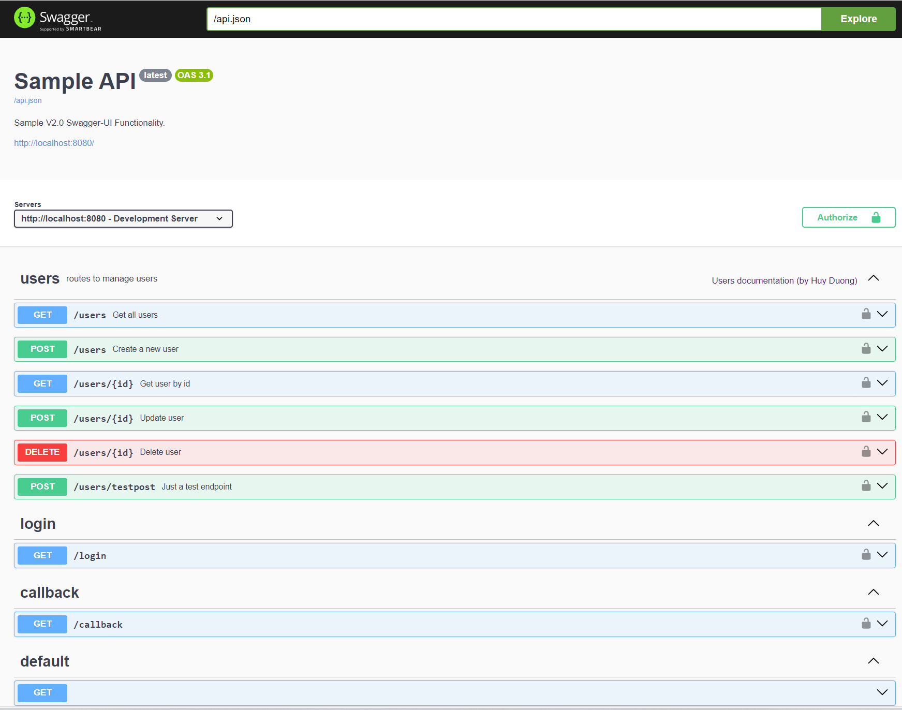

This is the general repository for API using Kotlin.
This template is using Ktor and Smiley4 for Swagger. It also implements OAuth2 and a basic controllers (User) with inmemory data.

For general contact information, contact the owner huydq@gmail.com.

The Swagger

